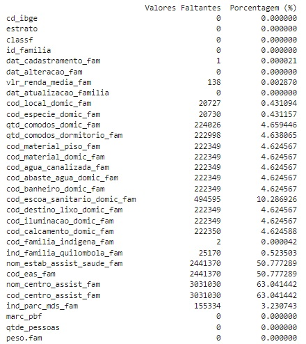
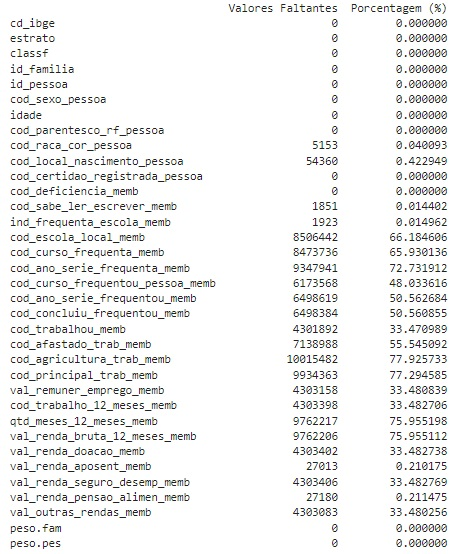
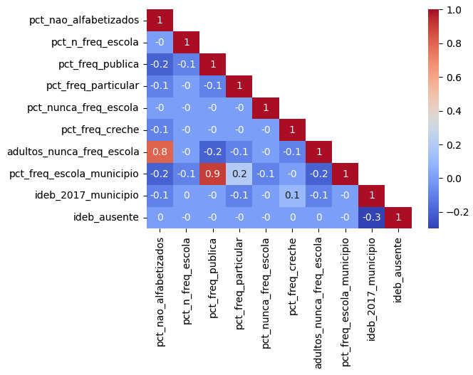

# Averiguação Cadastral
Repositório para projeto conjunto no âmbito do Bootcamp em Machine Learning com o objetivo de desenvolver um algoritmo para identificação automática do público de averiguação cadastral do Cadastro Único para Programas Sociais

#  

## Nome do projeto
Algoritmo de classificação usando técnicas de Machine Learning (ML) para identificação do público para averiguação Cadastral

## Descrição do problema 
O Cadastro Único para Programas Sociais é o principal instrumento do Estado brasileiro para a caracterização socioeconômica das famílias de baixa renda que residem no território nacional, para permitir a seleção e a inclusão dessas famílias em programas federais, sendo usado para a concessão dos benefícios do Programa Bolsa Família, do Pé de Meia, da Tarifa Social de Energia Elétrica, do Auxílio Gás, do Programa Minha Casa Minha Vida, entre outros. 

Para reduzir erros de inclusão, constantemente é feito um processo de qualificação cadastral. Neste ano, por exemplo, até o momento foram convocadas 3,3 milhões de famílias para averiguação do cadastro, o qual consiste em verificar as famílias que apresentam algum indício de inconsistência, seja de renda, de declaração de vínculo empregatício, ou de composição familiar.

Considerando a referência de setembro/2024, existem mais de 40 milhões de famílias incluídas no Cadastro Único, e 93 milhões de pessoas. Para uma melhor focalização das políticas públicas sociais usuárias deste cadastro para seleção dos beneficiários é preciso automatizar o processo de averiguação cadastral.

Para tanto, a proposta do presente projeto é propor um algoritmo que, a partir das características das família, seja possível classificar cada família em uma faixa de renda mais provável. Destaca-se que, considerando que as bases utilizadas são de 2018, os valores utilizados para a definição das faixas de renda serão as vigentes em 2018, conforme segue abaixo:
* Pobreza: de 0 a 178,00, considerando a faixa de pobreza do Programa Bolsa Família em 2018;
* Baixa renda: de 178,01 a 1/2 salário-mínimo vigente em 2018, ou seja 477,00 considerando o salário-mínimo de 954,00;
* Acima de 1/2 salário-mínimo, ou seja, acima de 477,00.

No Cadastro Único a renda familiar mensal utilizada para o cálculo da renda média familiar é a soma dos rendimentos brutos, ou seja, sem descontos, auferidos por todos os integrantes da família. Nesse cálculo, não são incluídos os valores referentes aos seguintes programas:
* Benefícios e auxílios assistenciais de natureza eventual e temporária;
* Valores oriundos de programas assistenciais de transferência de renda, com exceção do Benefício de Prestação Continuada de que trata o art. 20 da Lei nº 8.742, de 1993;
* Rendas de natureza eventual ou sazonal, na forma estabelecida em ato do Ministro de Estado do MDS; e
* Outros rendimentos, na forma estabelecida em ato do Ministro de Estado do MDS.

O valor da renda familiar mensal é dividida então pelo número de pessoas que compõem a família, variável 'qtd_pessoas' da **Base de Família**.
  
O modelo objetiva auxiliar em uma maior focalização das políticas públicas sociais para as famílias que apresentam características relacionadas à maior vulnerabilidade de renda, identificando famílias que apresentam caracterísiticas não esperadas para a faixa de renda apresentada, guiando ações de qualificação do Cadastro Único.

## Benefícios do uso do algoritmo de ML para automatização do processo de averiguação cadastral
* É possível incluir toda a base do Cadastro Único na análise de definição do público de averiguação cadastral, sem a necessidade de definição de amostra, ao aplicar o modelo de ML no universo total;
* É possível identificar as variáveis que contribuem diretamente para a definição automática das famílias a serem incluídas no processo de averigação cadastral, evitando critérios subjetivos para a seleção das variáveis;
* É possível atualizar o algoritmo com os dados mais atuais, de modo a acompanhar as mudanças das famílias ao longo do tempo. 

## Bases de dados utilizadas
As bases de dados utilizadas estão disponibilizadas no <a href="https://dados.gov.br/dados/conjuntos-dados/microdados-amostrais-do-cadastro-unico">Portal de Dados abertos do Governo Federal do MDS</a>.

As bases são amostrais, desidentificadas, sendo que as mais recentes disponíveis no portal de dados abertos, acessado em outubro/2024, são da referêcia de 2018.

Uma base apresenta os dados de pessoas e a outra base os dados das famílias. É possível combinar as duas bases de dados por meio da variável 'id_familia': Identificador único da família para pareamento com a base de pessoas. No caso da **Base famílias**, os dados estão relacionados à família, sendo uma por linha. No caso da **Base pessoas** é uma pessoa por linha, sendo que a variável 'id_familia' está repetida para as pessoas que compõem a mesma família. 

Como as bases são muito grandes, tendo a base de famílias mais de 4,8 milhões de linhas e a de pessoas mais de 12,8 milhões, foi preparada uma base amostral da base de famílias de 100 mil linhas retirando as colunas "nom_estab_assist_saude_fam", "cod_eas_fam", "nom_centro_assist_fam" e "cod_centro_assist_fam" por não serem relevantes para a construção do modelo e por apresentarem muitos valores vazios conforme imagem abaixo.



Também foram retiradas as colunas relacionadas diretamente à renda da família, pois o objetivo do projeto é identificar as características das famílias que estão mais diretamente relacionadas à faixa de renda. A inclusão dos valores recebidos estão muito diretamente relacionados à classificação da renda e não permitiriam a avaliação das demais variáveis. Desta forma, para a análise, a variável 'marc_pbf' foi retirada da **Base famílias**, assim como as variáveis 'val_remuner_emprego_memb', 'val_renda_bruta_12_meses_memb', 'val_renda_doacao_memb', 'val_renda_aposent_memb', 'val_renda_seguro_desemp_memb', 'val_renda_pensao_alimen_memb' e 'val_outras_rendas_memb' foram retiradas na **Base pessoas**. 
Além disso, os valores são variáveis derivadas, utilizadas para o cálculo da 'vlr_renda_media_fam', que foi a base para a produção da variável target. Assim, o uso dessas variáveis poderia comprometer a eficácia do modelo ao vazar informação.  

Além disso, foram incluídas, após a coluna cd_ibge, duas novas colunas, uf_ibge e regiao_ibge, de modo a permitir a análise se essas variáveis contribuem para a acurácia do modelo.

A partir da base amostral de famílias, foi feito um merge com a base pessoas, usando o id_familia. Para tanto, foram excluídas as colunas "cd_ibge", "estrato" e "classf" da base de pessoas, pois são colunas comuns à base de famílias e não foram usadas para o merge, já que apenas o valor id_familia é único na base de famílias.

Registra-se que na base de pessoas também foram encontrados valores vazio, conforme imagem abaixo. Isso se deve a regras de preenchimento do formulário do Cadastro Único, que para alguns campos o seu preenchimento é condicionado ao preenchimento de outro. Desta forma, o processo de limpeza dos valores NaN foi realizado com base nessas regras e será detalhado em campo específico.



Na base final, foram mantidades aproximadamente 100 mil famílias incluídas na base amostral de famílias e as pessoas da base de pessoas relacionadas com o mesmo id_familia da base amostral, resultando em uma base amostral de famílias e pessoas com mais de 250 mil linhas. Destaca-se que foram preparadas duas bases amostrais distintas, randomizadas e aleatórias, para apoiar o processo de construção do modelo.

Abaixo segue o dicionário das bases utilizadas.

### Base famílias

| Seq. | Nome da variável                 | Tipo   | Tamanho (Inteiro) | Tamanho (Decimal) | Descrição                                                                                                     |
|------|-----------------------------------|--------|-------------------|------------------|---------------------------------------------------------------------------------------------------------------|
| 1    | cd_ibge                          | String | 7                 |                  | Código IBGE do Município                                                                                       |
| 1a    | uf_ibge                          | Numeric | 2                 |              | Código IBGE da Unidade Federada: 12	- AC, 27 - AL, 13	- AM, 16 - AP, 29 -	BA, 23 - CE, 53 -	DF, 32	- ES, 52 - GO, 21 -	MA, 31 -	MG, 50 -	MS, 51	- MT, 15 - PA, 25 -	PB, 26 -	PE, 22	- PI, 41 -	PR, 33 -	RJ, 24	- RN, 11 - RO, 14 -	RR, 43 -	RS, 42 -	SC, 28 -	SE, 35 -	SP, 17 - TO  :exclamation::heavy_exclamation_mark: **(Coluna nova incluída na base amostral)** |
| 1b    | regiao_ibge                      | Numeric | 2                 |                  | Região da Unidade Federada: 1 - Norte, 2 - Nordeste, 3 - Sudeste, 4 - Sul, 5 - Centro-Oeste :exclamation::heavy_exclamation_mark: **(Coluna nova incluída na base amostral)**|
| 2    | dat_cadastramento_fam             | String | 8                 |                  | Data do cadastramento da família no formato YYYY-MM-DD  :exclamation::heavy_exclamation_mark:**(Coluna excluída na base amostral)**               |
| 3    | dat_alteracao_fam                 | Date   | 8                 |                  | Data da última alteração em qualquer campo da família no formato YYYY-MM-DD (Variável utilizada nos anos de 2014, 2015, 2016 e 2017)  :exclamation::heavy_exclamation_mark: **(Coluna excluída na base amostral)**    |
| 4    | vlr_renda_media_fam               | Numeric| 9                 |                  | Valor da renda média (per capita) da família, formato NNNNNNNNN (não tem a vírgula). Ex.: Uma renda de R$ 125,00 constará na base como 125   |
| 5    | dat_atualizacao_familia           | Date   | 8                 |                  | Data da última atualização da família dos dados considerados sensíveis à manutenção do cadastro no formato YYYY-MM-DD (2014-2017)    :exclamation::heavy_exclamation_mark:**(Coluna excluída na base amostral)**      |
| 6    | dat_atual_fam                     | Date   | 8                 |                  | Data da última alteração em qualquer campo da família no formato YYYY-MM-DD (variável utilizada nos anos de 2012 e 2013)         :exclamation::heavy_exclamation_mark: **(Coluna excluída na base amostral)**     |
| 7    | cod_local_domic_fam               | Numeric| 1                 |                  | Características do local onde está situado o domicílio: 1 - Urbanas, 2 - Rurais, 9 - Nenhuma das respostas anteriores   |
| 8    | cod_especie_domic_fam             | Numeric| 1                 |                  | Espécie do domicílio: 1 - Particular Permanente, 2 - Particular improvisado, 3 - Coletivo, 9 - Nenhuma das respostas anteriores    |
| 9    | qtd_comodos_domic_fam             | Numeric| 2                 |                  | Quantidade de cômodos do domicílio ou -1 quando o campo não se aplica                                          |
| 10   | qtd_comodos_dormitorio_fam        | Numeric| 2                 |                  | Quantidade de cômodos servindo como dormitório do domicílio ou -1 quando o campo não se aplica        |
| 11   | cod_material_piso_fam             | Numeric| 1                 |                  | Material predominante no piso do domicílio: 1 - Terra, 2 - Cimento, 3 - Madeira aproveitada, 4 - Madeira aparelhada, 5 - Cerâmica, lajota ou pedra, 6 - Carpete, 7 - Outro Material ou -1 quando o campo não se aplica   |
| 12   | cod_material_domic_fam            | Numeric| 1                 |                  | Material predominante nas paredes externas do domicílio: 1 - Alvenaria/tijolo com revestimento, 2 - Alvenaria/tijolo sem revestimento,  3 - Madeira aparelhada, 4 - Taipa revestida, 5 - Taipa não revestida, 6 - Madeira aproveitada, 7 - Palha, 8 - Outro Material ou -1 quando o campo não se aplica  |
| 13   | cod_agua_canalizada_fam           | Numeric| 1                 |                  | Se o domicílio tem água encanada: 1 - Sim, 2 - Não  ou -1 quando o campo não se aplica   |
| 14   | cod_abaste_agua_domic_fam         | Numeric| 1                 |                  | Forma de abastecimento de água: 1 - Rede geral de distribuição, 2 - Poço ou nascente, 3 - Cisternas, 4 - Outra forma ou -1 quando o campo não se aplica    |
| 15   | cod_banheiro_domic_fam            | Numeric| 1                 |                  | Existência de banheiro: 1 - Sim, 2 - Não   ou -1 quando o campo não se aplica            |
| 16   | cod_escoa_sanitario_domic_fam     | Numeric| 1                 |                  | Forma de escoamento sanitário: 1 - Rede coletora de esgoto ou pluvial, 2 - Fossa séptica,  3 - Fossa rudimentar, 4 - Vala a céu aberto, 5 - Direto para um rio, lago ou mar,   6 - Outra forma ou -1 quando o campo não se aplica     |
| 17   | cod_destino_lixo_domic_fam        | Numeric| 1                 |                  | Forma de coleta do lixo: 1 - É coletado diretamente, 2 - É coletado indiretamente, 3 - É queimado ou enterrado na propriedade,  4 - É jogado em terreno baldio ou logradouro (rua, avenida, etc.), 5 - É jogado em rio ou mar, 6 - Tem outro destino ou -1 quando o campo não se aplica     |
| 18   | cod_iluminacao_domic_fam          | Numeric| 1                 |                  | Tipo de iluminação: 1 - Elétrica com medidor próprio, 2 - Elétrica com medidor comunitário, 3 - Elétrica sem medidor, 4 - Óleo, querosene ou gás, 5 - Vela, 6 - Outra forma ou -1 quando o campo não se aplica   |
| 19   | cod_calcamento_domic_fam          | Numeric| 1                 |                  | Calçamento: 1 - Total, 2 - Parcial, 3 - Não existe ou -1 quando o campo não se aplica  |
| 20   | cod_familia_indigena_fam          | Numeric| 1                 |                  | Família indígena: 1 - Sim, 2 - Não                                                                             |
| 21   | ind_familia_quilombola_fam        | Numeric| 1                 |                  | Família quilombola: 1 - Sim, 2 - Não                                                                           |
| 22   | nom_estab_assist_saude_fam        | String | 70                |                  | Nome do estabelecimento EAS/MS   :exclamation::heavy_exclamation_mark: **(Coluna excluída na base amostral)**     |
| 23   | cod_eas_fam                       | String | 12                |                  | Código do estabelecimento EAS/MS  :exclamation::heavy_exclamation_mark:  **(Coluna excluída na base amostral)**    |
| 24   | nom_centro_assist_fam             | String | 70                |                  | Nome do CRAS/CREAS :exclamation::heavy_exclamation_mark: **(Coluna excluída na base amostral)**            |
| 25   | cod_centro_assist_fam             | String | 12                |                  | Código do CRAS/CREAS :exclamation::heavy_exclamation_mark:  **(Coluna excluída na base amostral)**     |
| 26   | ind_parc_mds_fam                  | Numeric| 3                 |                  | Grupos tradicionais e específicos: 101 Família Cigana, 201 Família Extrativista, 202 Família de Pescadores, 203 Família pertencente a Comunidade de Terreiro, 204 Família Ribeirinha, 205 Família de Agricultores Familiares, 301 Família Assentada da Reforma Agrária, 302 Família beneficiária do Programa Nacional de Crédito Fundiário, 303 Família Acampada, 304 Família Atingida por Empreendimentos de Infraestrutura, 305 Família de Preso do Sistema Carcerário, 306 Família de Catadores de Material Reciclável, 000 Nenhuma ou 9 - Nenhuma das respostas anteriores|
| 27   | peso_fam                          | Numeric| 1                 | 14               | Peso calculado da família                                                                                      |
| 28   | id_familia                        | Numeric| 8                 |                  | Identificador único da família para pareamento com a base de pessoas                                           |
| 29   | estrato                           | Numeric| 1                 |                  | Grandes grupos de municípios, de acordo com a quantidade de famílias cadastradas: 1 - GM1 (101 a 5.000 famílias) ou 2 - GM1 (5.001 ou mais famílias) |
| 30   | classf                            | Numeric| 1                 |                  | Subdivisão pela Unidade Federativa e divisão administrativa: 1 - Capital, 2 - Região Metropolitana (RM) ou Região Integrada de Desenvolvimento (RIDE), 3 - Outros          |
| 31   | qtd_pessoas                       | Numeric| 1                 |                  | Quantidade de pessoas utilizada no cálculo da renda per capita familiar – variável calculada pelo sistema        |
| 32   | marc_pbf                          | Numeric| 1                 |                  | Marcação se a família é beneficiária do Programa Bolsa Família: 0 – Não, 1 – Sim **(Coluna excluída na base amostral)**  |
| 33 | dias_cadastramento                  | Numeric | 1 a 4            |                  | Número de dias entre 31/12/2018 e a data dat_cadastramento_fam  :exclamation::heavy_exclamation_mark: **(Coluna nova incluída na base amostral)**|
| 34 | dias_atualizacao                   | Numeric | 1 a 4            |                  | Número de dias entre 31/12/2018 e a data dat_atualizacao_familia  :exclamation::heavy_exclamation_mark: **(Coluna nova incluída na base amostral)**|
| 35 | classe_renda                      | Numeric  | 1                |                   | Classificação da faixa de renda da família, calculada a partir do vlr_renda_media_fam: 0 - pobreza, 1 - baixa renda, 2 - acima de 1/2 S.M. :exclamation::heavy_exclamation_mark: **(Coluna nova incluída na base amostral)**|


### Base pessoas

| Seq. | Nome da variável                 | Tipo    | Tamanho (Inteiro) | Tamanho (Decimal) | Descrição                                                                                                                                           |
|------|-----------------------------------|---------|-------------------|-------------------|-----------------------------------------------------------------------------------------------------------------------------------------------------|
| 1    | cd_ibge                          | String  | 7                 |                   | Código IBGE do Município :exclamation::heavy_exclamation_mark:   **(Coluna excluída na base amostral)**        |
| 2    | cod_sexo_pessoa                  | Numeric | 1                 |                   | Sexo: 1 - Masculino, 2 - Feminino                                                                                                                    |
| 3    | idade                            | Numeric | 3                 |                   | Idade calculada a partir da diferença entre a data de nascimento da pessoa e a data de referência da base                                             |
| 4    | cod_parentesco_rf_pessoa          | Numeric | 2                 |                   | Relação de parentesco com o RF: 1 - Pessoa Responsável pela Unidade Familiar, 2 - Cônjuge ou companheiro(a), 3 - Filho(a), 4 - Enteado(a), 5 - Neto(a) ou bisneto(a), 6 - Pai ou mãe,  7 - Sogro(a), 8 - Irmão ou irmã,  9 - Genro ou nora, 10 - Outro parente, 11 - Não parente    |
| 5    | cod_raca_cor_pessoa              | Numeric | 1                 |                   | Cor ou raça: 1 - Branca, 2 - Preta, 3 - Amarela, 4 - Parda, 5 - Indígena                                                                             |
| 6    | cod_local_nascimento_pessoa      | Numeric | 1                 |                   | Local de nascimento: 1 - Neste município, 2 - Em outro município, 3 - Em outro país                                                                  |
| 7    | cod_certidao_registrada_pessoa   | Numeric | 1                 |                   | Pessoa registrada em cartório: 1 - Sim e tem Certidão de Nascimento, 2 - Sim, mas não tem Certidão, 3 - Não                                           |
| 8    | cod_deficiencia_memb             | Numeric | 1                 |                   | Pessoa tem deficiência: 1 - Sim, 2 - Não                                                                                                             |
| 9    | cod_sabe_ler_escrever_memb       | Numeric | 1                 |                   | Pessoa sabe ler e escrever: 1 - Sim, 2 - Não                                                                                                         |
| 10   | ind_frequenta_escola_memb        | Numeric | 1                 |                   | Pessoa frequenta escola: 1 - Sim, rede pública, 2 - Sim, rede particular, 3 - Não, já frequentou, 4 - Nunca frequentou                               |
| 11   | cod_escola_local_memb            | Numeric | 1                 |                   | Escola localizada no município: 1 - Sim, 2 - Não ou -1 quando o campo não se aplica                                                                  |
| 12   | cod_curso_frequenta_memb         | Numeric | 2                 |                   | Curso que a pessoa frequenta: 1 - Creche, 2 - Pré-escola (exceto CA), 3 - Classe de Alfabetização - CA, 4 - Ensino Fundamental regular (duração 8 anos),  5 - Ensino Fundamental regular (duração 9 anos), 6 - Ensino Fundamental especial, 7 - Ensino Médio regular, 8 - Ensino Médio especial, 9 - Ensino Fundamental EJA - séries iniciais (Supletivo - 1ª a 4ª),  10 - Ensino Fundamental EJA - séries finais (Supletivo - 5ª a 8ª), 11 - Ensino Médio EJA (Supletivo), 12 - Alfabetização para adultos (Mobral, etc.), 13 - Superior, Aperfeiçoamento, Especialização, Mestrado, Doutorado, 14 - Pré-vestibular ou -1 quando o campo não se aplica |
| 13   | cod_ano_serie_frequenta_memb     | Numeric | 2                 |                   | Ano e série que a pessoa frequenta: 1 - Primeiro, 2 - Segundo, 3 - Terceiro, 4 - Quarto(a), 5 - Quinto(a), 6 - Sexto(a), 7 - Sétimo(a), 8 - Oitavo(a), 9 - Nono(a), 10 - Curso não-seriado ou -1 quando o campo não se aplica |
| 14   | cod_curso_frequentou_pessoa_memb | Numeric | 2                 |                   | Curso mais elevado que a pessoa frequentou: 1 - Creche, 2 - Pré-escola (exceto CA), 3 - Classe de Alfabetização - CA, 4 - Ensino Fundamental 1ª a 4ª séries, Elementar (Primário), Primeira fase do 1º grau, 5 - Ensino Fundamental 5ª a 8ª séries, Médio 1º ciclo (Ginasial), Segunda fase do 1º grau, 6 - Ensino Fundamental (duração 9 anos), 7 - Ensino Fundamental Especial, 8 - Ensino Médio, 2º grau, Médio 2º ciclo (Científico, Clássico, Técnico, Normal), 9 - Ensino Médio Especial, 10 - Ensino Fundamental EJA - séries iniciais (Supletivo 1ª a 4ª), 11 - Ensino Fundamental EJA - séries finais (Supletivo 5ª a 8ª), 12 - Ensino Médio EJA (Supletivo), 13 - Superior, Aperfeiçoamento, Especialização, Mestrado, Doutorado, 14 - Alfabetização para Adultos (Mobral, etc.), 15 - Nenhum ou -1 quando o campo não se aplica  |
| 15   | cod_ano_serie_frequentou_memb    | Numeric | 2                 |                   | Último ano e série frequentado pela pessoa: 1 - Primeiro, 2 - Segundo, 3 - Terceiro, 4 - Quarto(a), 5 - Quinto(a), 6 - Sexto(a), 7 - Sétimo(a), 8 - Oitavo(a), 9 - Nono(a), 10 - Curso não-seriado ou -1 quando o campo não se aplica  |
| 16   | cod_concluiu_frequentou_memb     | Numeric | 1                 |                   | A pessoa concluiu o curso: 1 - Sim, 2 - Não  ou -1 quando o campo não se aplica                                    |
| 17   | cod_trabalhou_memb               | Numeric | 1                 |                   | Pessoa trabalhou na semana passada: 1 - Sim, 2 - Não  ou -1 quando o campo não se aplica                                           |
| 18   | cod_afastado_trab_memb           | Numeric | 1                 |                   | Pessoa afastada na semana passada: 1 - Sim, 2 - Não ou -1 quando o campo não se aplica                                                |
| 19   | cod_agricultura_trab_memb        | Numeric | 1                 |                   | É atividade extrativista: 1 - Sim, 2 - Não, -1 quando o campo não se aplica  ou 9 - para desconhecido                   |
| 20   | cod_principal_trab_memb          | Numeric | 2                 |                   | Função principal: 1 - Trabalhador por conta própria, 2 - Trabalhador temporário em área rural, 3 - Empregado sem carteira de trabalho assinada, 4 - Empregado com carteira de trabalho assinada, 5 - Trabalhador doméstico sem carteira de trabalho assinada, 6 - Trabalhador doméstico com carteira de trabalho assinada, 7 - Trabalhador não-remunerado, 8 - Militar ou servidor público, 9 - Empregador, 10 - Estagiário, 11 - Aprendiz ou -1 quando o campo não se aplica|
| 21   | val_remuner_emprego_memb         | Numeric | 5                 |                   | Valor da remuneração no formato NNNNN (sem casas decimais). Ex: uma remuneração de R$ 125,00 constará na base como 125         :exclamation::heavy_exclamation_mark: **(Coluna excluída na base amostral)** |
| 22   | cod_trabalho_12_meses_memb       | Numeric | 1                 |                   | Pessoa com trabalho remunerado em algum período nos últimos 12 meses: 1 - Sim, 2 - Não  ou -1 quando o campo não se aplica      |
| 23   | qtd_meses_12_meses_memb          | Numeric | 2                 |                   | Quantidade de meses trabalhados nos últimos 12 meses ou -1 quando o campo não se aplica                    |
| 24   | val_renda_bruta_12_meses_memb    | Numeric | 5                 |                   | Valor de remuneração bruta no formato NNNNN (sem casas decimais). Ex: uma remuneração de R$ 125,00 constará na base como 125   :exclamation::heavy_exclamation_mark: **(Coluna excluída na base amostral)**  |
| 25   | val_renda_doacao_memb            | Numeric | 5                 |                   | Valor recebido de doação no formato NNNNN (sem casas decimais). Ex: uma renda de R$ 125,00 constará na base como 125           :exclamation::heavy_exclamation_mark: **(Coluna excluída na base amostral)**  |
| 26   | val_renda_aposent_memb           | Numeric | 5                 |                   | Valor recebido de aposentadoria no formato NNNNN (sem casas decimais). Ex: uma remuneração de R$ 125,00 constará na base como 125  :exclamation::heavy_exclamation_mark: **(Coluna excluída na base amostral)**  |
| 27   | val_renda_seguro_desemp_memb     | Numeric | 5                 |                   | Valor recebido de seguro desemprego no formato NNNNN (sem casas decimais). Ex: um valor de R$ 125,00 constará na base como 125   :exclamation::heavy_exclamation_mark: **(Coluna excluída na base amostral)** |
| 28   | val_renda_pensao_alimen_memb     | Numeric | 5                 |                   | Valor recebido de pensão alimentícia no formato NNNNN (sem casas decimais). Ex: uma renda de R$ 125,00 constará na base como 125    :exclamation::heavy_exclamation_mark: **(Coluna excluída na base amostral)**  |
| 29   | val_outras_rendas_memb           | Numeric | 5                 |                   | Valor recebido de outras fontes no formato NNNNN (sem casas decimais). Ex: uma renda de R$ 125,00 constará na base como 125       :exclamation::heavy_exclamation_mark: **(Coluna excluída na base amostral)**  |
| 30   | peso.fam                        | Numeric | 1                 | 14                | Peso calculado da família                                                                                                         :exclamation::heavy_exclamation_mark: **(Coluna excluída na base amostral)**  |
| 31   | peso.pes                        | Numeric | 1                 | 14                | Peso calculado da pessoa                                                                                                                             |
| 32   | id_familia                      | Numeric | 8                 |                   | Identificador único da família de vinculação da pessoa para pareamento com a base de famílias                                                        |
| 33   | estrato                         | Numeric | 1                 |                   | São grandes grupos de municípios, de acordo com a quantidade de famílias cadastradas: 1 - GM1 (101 A 5.000 famílias), 2 - GM2 (5.001 ou mais famílias)  :exclamation::heavy_exclamation_mark: **(Coluna excluída na base amostral)**   |
| 34   | classf                          | Numeric | 1                 |                   | Subdivisão pela Unidade Federativa e divisão administrativa: 1 - Capital, 2 - Região Metropolitana (RM) ou Região Integrada de Desenvolvimento (RIDE) :exclamation::heavy_exclamation_mark:  **(Coluna excluída na base amostral)**   |

## Limpeza das bases
Tanto na **Base famílias**, quanto na **Base pessoas** existe um número considerável de valores vazios considerando as regras de preenchimento do formulário do Cadastro Único. Assim, foi necessário olhar para as regras de preenchimento do formulário do Cadastro Único, com base no Manual do Entrevistador do Cadastro Único, de modo a identificar os valores vazios pelo fato de não serem de preenchimento obrigatório.
Assim foram realizadas as seguintes limpezas dos valores NaN:

### Base famílias
#### Campos relacionados às características do domicílio:
Os campos 'qtd_comodos_domic_fam', 'qtd_comodos_dormitorio_fam', 'cod_material_piso_fam', 'cod_material_domic_fam', 'cod_agua_canalizada_fam', 'cod_abaste_agua_domic_fam', 'cod_banheiro_domic_fam', 'cod_escoa_sanitario_domic_fam', 'cod_destino_lixo_domic_fam', 'cod_iluminacao_domic_fam', 'cod_calcamento_domic_fam' só são de preenchimento obrigatório no caso da resposta ter sido "1- Particular permamente" no campo 'cod_especie_domic_fam'. Sendo assim, quando o campo 'cod_especie_domic_fam' é diferente de 1, os valores dos campos relacionados às características do domicílio foi preenchido com **-1**.
#### Campo relacionado ao escoamento sanitário:
O campo 'cod_escoa_sanitario_domic_fam' só é de preenchimento obrigatório quando o campo 'cod_banheiro_domic_fam' é preenchido com "1 - Sim". Desta forma, quando o campo 'cod_banheiro_domic_fam' é igual a 2 (ou seja, não possui banheiro), o valor do campo 'cod_escoa_sanitario_domic_fam' foi preenchido com **-1**.
#### Campo relacionado à família quilombola:
O campo 'ind_familia_quilombola_fam' só deve ser preenchido caso o campo 'cod_familia_indigena_fam' for "2 - Não". Assim, quando o campo 'cod_familia_indigena_fam' é igual a 1 (ou seja, a família for indígena), o valor do campo 'ind_familia_quilombola_fam' foi marcado como **2**, ou seja, a família não é quilombola.
#### Campos relacionados ao local do domicílio e à espécie do domicílio:
Foi identificado que os valores vazios dos campos 'cod_especie_domic_fam' e 'cod_local_domic_fam' coincidem, ou seja, quando um valor é vazio na campo 'cod_especie_domic_fam' também é vazio no campo 'cod_local_domic_fam'. Na base de dados amostral de 2018 disponível no portal de dados abertos, não tem a marcação se a família vive em situação de rua. No Manual do entrevistador há a orientação de que, caso a família esteja em situação de rua, o bloco 2 - características do domicílio não deve ser preenchido, pois existe um cadastramento diferenciado. Desta forma, este caso de valores ausentes pode estar relacionado à situação de rua. De modo a tentar captar se essa condição interfere no modelo, os valores dos dois campos foram preenchidos com **9**, representando nenhuma das outras repostas.
#### Campos relacionadas à Grupos tradicionais e específicos
O campo 'ind_parc_mds_fam' está relacionado à marcação de grupos tradicionais e específicos para além de indígena, quilombola, situação de rua ou resgatados do trabalho análogo ao de escravo. Foi avaliado se os valores ausentes estavam relacionados à marcação de indígena ou quilombola, ou ao valor 9 para 'cod_especie_domic_fam' e 'cod_local_domic_fam' criado na tentativa de captar as famílias em situação de rua. Não foi identificado o motivo dos valores vazios. Assim, de modo a tentar captar se a ausência de marcação deste campo pode representar alguma situação que impacte no modelo, os valores vazios foram preenchidos com **9**, representando nenhuma das outras repostas.
#### Valores vazios remanescentes
Após todas as limpezas descritas acima, ficou um resquício insignificantes de linhas com valores vazios que foram excluídas da base:
* qtd_comodos_domic_fam         41
* qtd_comodos_dormitorio_fam    10
* classe_renda                   3

### Base pessoas
#### Campo frequenta escola
Os campos 'cod_escola_local_memb', 'cod_curso_frequenta_memb', 'cod_ano_serie_frequenta_memb' só são obrigatório se a pessoa respondeu "1 - Sim, rede pública", "2 - Sim, rede particular" no campo 'ind_frequenta_escola_memb'. Desta forma, quando o campo 'ind_frequenta_escola_memb' foi preenchido com valor diferente de 1 ou 2, os campos vazios relacionados foram preenchidos com **-1**.
#### Campo ano e série que a pessoa frequenta
O campo 'cod_ano_serie_frequenta_memb' só é obrigatório ser preenchido quando no campo 'cod_curso_frequenta_memb' (curso que a pessoa frequenta) a pessoa respondeu uma das opções: 4 - Ensino Fundamental regular (duração 8 anos), 5 - Ensino Fundamental regular (duração 9 anos), 6 - Ensino Fundamental especial, 7 - Ensino Médio regular ou 8 - Ensino Médio especial. Assim, quando o campo 'cod_curso_frequenta_memb' foi preenchido com valor difente de 4, 5, 6, 7 ou 8 os valores vazios de 'cod_ano_serie_frequenta_memb' foram preenchidos com **-1**.
#### Campo curso mais elevado que frequentou
O campo 'cod_curso_frequentou_pessoa_memb' só é obrigatório quando o campo 'ind_frequenta_escola_memb' (Pessoa frequenta escola?) for respondido com "3 - Não, já frequentou". Assim, quando o campo 'ind_frequenta_escola_memb' estava diferente de 3, os valores vazios do campo 'cod_curso_frequentou_pessoa_memb' foram preenchidos com **-1**.
#### Campos relacionados ao curso frequentado
Os campos 'cod_ano_serie_frequentou_memb' e 'cod_concluiu_frequentou_memb' só devem ser preenchidos caso a pessoa frequentou algum dos cursos 4 - Ensino Fundamental 1ª a 4ª séries, Elementar (Primário), Primeira fase do 1º grau, 5 - Ensino Fundamental 5ª a 8ª séries, Médio 1º ciclo (Ginasial), Segunda fase do 1º grau, 6 - Ensino Fundamental (duração 9 anos), 7 - Ensino Fundamental Especial, 8 - Ensino Médio, 2º grau, Médio 2º ciclo (Científico, Clássico, Técnico, Normal) ou 9 - Ensino Médio Especial no campo 'cod_curso_frequentou_pessoa_memb'. Desta forma, quando a resposta do campo 'cod_curso_frequentou_pessoa_memb' foi diferente de 4, 5, 6, 7, 8 e 9 os valores vazios dos campos 'cod_ano_serie_frequentou_memb' e 'cod_concluiu_frequentou_memb' foi preenchido com **-1**.
#### Campos relacionados ao trabalho
Os campos 'cod_trabalhou_memb', 'cod_afastado_trab_memb', 'cod_agricultura_trab_memb', 'cod_principal_trab_memb', 'cod_trabalho_12_meses_memb', 'qtd_meses_12_meses_memb' só devem ser preenchidos para pessoas com 14 anos ou mais. Assim, para o caso de pessoas com idade menor que 14 anos, no campo 'idade', os valores dos campos relacionados ao trabalho foram preenchidos com **-1**.
#### Campo relacionado ao afastamento do trabalho
O campo 'cod_afastado_trab_memb' só deve ser respondido se o campo 'cod_trabalhou_memb' (Pessoa trabalhou na semana passada?) for respondido como "2 - Não". Assim, para os casos de resposta diferente de 2, os valores vazios do campo 'cod_afastado_trab_memb' foram preenchidos com **-1**.
#### Campo relacionado à atividade extrativista e ao trabalho principal
O campo 'cod_agricultura_trab_memb' (É atividade extrativista? 1 - Sim e 2 - Não) e o campo 'cod_principal_trab_memb' só são obrigatórios se a pessoa respondeu 1 - Sim no campo 'cod_trabalhou_memb' (Pessoa trabalhou na semana passada?) ou no campo 'cod_afastado_trab_memb' (Pessoa afastada na semana passada?). Assim, para o caso em que os 'cod_trabalhou_memb' e 'cod_afastado_trab_memb' tiveram resposta diferente de 1, os valores vazios de 'cod_agricultura_trab_memb' e de 'cod_principal_trab_memb' foram substituídos por **-1**. 
Além disso, observou-se ainda alguns valores vazios remanescentes para o campo 'cod_agricultura_trab_memb'. Desta forma, foi avaliado o preenchimento do campo 'cod_principal_trab_memb'. Quando este estava marcado com "2 - Trabalhador temporário em área rural", o valor vazio do campo 'cod_agricultura_trab_memb' foi alterado para "**1** - Sim" e para os demais casos para **9** - Desconhecido.  
#### Campo relacionado à quantidade de meses trabalhados
O campo 'qtd_meses_12_meses_memb' (Quantidade de meses trabalhados nos últimos 12 meses) só é obrigatório se a pessoa tiver respondido "1 - Sim" no campo 'cod_trabalho_12_meses_memb' (Pessoa com trabalho remunerado em algum período nos último 12 meses). Desta forma, os valores vazios do campo 'qtd_meses_12_meses_memb' foi alterado para **-1** quando o campo 'cod_trabalho_12_meses_memb' for diferente de 1.
#### Valores vazios remanescentes
Foram feitas diversas análises adicionais para identificar possíveis ajustes nos valores vazios finais. Entretanto, não foi identificada outra situação de valor vazio que parece estar relacionado à regra de preenchimento do Cadastro Único. Desta forma, as linhas com valores vazios remanescentes foram excluídas, conforme segue abaixo. Destaca-se que esses valores são pouco representativos frente ao total de linhas da base amostral de pessoas, que possui mais de 260 mil linhas.
* cod_raca_cor_pessoa                  107
* cod_local_nascimento_pessoa         1118
* cod_sabe_ler_escrever_memb            45
* ind_frequenta_escola_memb             49
* cod_escola_local_memb                661
* cod_curso_frequenta_memb              13
* cod_curso_frequentou_pessoa_memb      13
* cod_ano_serie_frequentou_memb          2
* cod_trabalhou_memb                   643
* cod_trabalho_12_meses_memb           676

Após a limpeza da base amostral de pessoas, foi feito um merge com a base amostral de famílias, de modo a retirar as famílias que tiveram pessoas excluídas, gerando uma base final com mais de 96 mil famílias e com mais de 250 mil pessoas.

## Variável dependente (target)
A variavél dependente do projeto é classe_renda:
* Classe 0 (pobreza);
* Classe 1 (baixa renda);
* Classe 2 (acima 1/2 S.M.).

## Variáveis independentes (features)
Para a seleção das variáveis independentes, serão aplicadas técnicas de Machine Learning para definição das que contribuem diretamente para a classificação mais adequada das famílias nas classes de renda. Além disso, será realizada engenharia de features para a construção de novas variáveis, a partir das existentes, que podem contribuir para a maior acurácia do modelo. 
De modo a ouvir a área de negócio, foram realizadas reuniões com a Coordenadora-Geral de Acompanhamento e Qualificação do Cadastro, do Departamento de Operação do Cadastro Único (CGAQC/DECAU). 
A partir das contribuições da área de negócio e com o objetivo de possibilitar o exercício por todos os autores do projeto no âmbito do Bootcamp, as análises foram dividdas em grupos temáticos, conforme se segue:

### Características do Responsável Familiar - Mariana:
O Responsável pela Unidadde Familiar (RUF) é a pessoa responsável por prestar as informações ao Cadastro Único em nome da família, que pode ser: 
* Responsável Familiar (RF) - deve ser um dos componentes da família e morador do domicílio, com idade mínima de 16 (dezesseis) anos, preferencialmente mulher;
* Representante Legal (RL) - indivíduo não membro da família e que não seja morador do domicílio, legalmente responsável por pessoas menores de dezesseis anos ou incapazes e responsável por prestar as informações ao Cadastro Único, quando não houver morador caracterizado como Responsável Familiar. Nas situações em que a família tiver o RL, este a representará e atuará em nome da família que está sendo cadastrada. Sendo assim, o RL
que será entrevistado para prestar as informações da família e de seus integrantes. No momento da entrevista, as informações de todas as pessoas da família devem ser prestadas pelo RUF.

De modo a avaliar se as características do RF contribuem para a acurácia do modelo, serão incluídas as seguintes variáveis no modelo da **Base Pessoas** para 'cod_parentesco_rf_pessoa' igual a 1, ou seja, "Pessoa Responsável pela Unidade Familiar":
* cod_sexo_pessoa;
* idade;
* cod_raca_cor_pessoa;
* cod_local_nascimento_pessoa;
* cod_certidao_registrada_pessoa;
* cod_deficiencia_memb;
* cod_sabe_ler_escrever_memb;
* ind_frequenta_escola_memb;
* cod_escola_local_memb;
* cod_curso_frequenta_memb;
* cod_ano_serie_frequenta_memb;
* cod_curso_frequentou_pessoa_memb;
* cod_ano_serie_frequentou_memb;
* cod_concluiu_frequentou_memb;
* cod_trabalhou_memb;
* cod_afastado_trab_memb;
* cod_agricultura_trab_memb;
* cod_principal_trab_memb;
* cod_trabalho_12_meses_memb;
* qtd_meses_12_meses_memb.

#### Resultado da análise
Foi realizada a análise das variáveis relacionadas ao responsável familiar a partir da base amostral de pessoas, filtrando 'cod_parentesco_rf_pessoa' igual a 1. Para tanto, foi gerada uma matriz de correlação das variáveis, conforme figura abaixo.


A partir da análise da matriz, foram retiradas as variáveis com correlação maior que 0.8, por terem uma forte relação linear entre si, de modo a evitar a:
* Multicolinearidade, que ocorre quando duas ou mais variáveis independentes em um modelo têm uma correlação forte entre si. Quando isso acontece, torna-se difícil para o modelo determinar o impacto individual de cada variável nas previsões, pois elas trazem informações muito semelhantes. Isso pode inflar os coeficientes de regressão em modelos lineares, tornando as estimativas menos confiáveis. O modelo se torna sensível a pequenas mudanças nos dados, resultando em coeficientes instáveis, que podem variar bastante se o conjunto de dados for alterado, comprometendo a interpretabilidade e a precisão do modelo.
* Redundância de Informação, pois incluir variáveis redundantes não acrescenta novas informações ao modelo e pode, inclusive, aumentar o ruído. Em vez de contribuir para a previsão, elas podem apenas aumentar a complexidade do modelo sem melhorar seu desempenho, podendo levar a um ajuste excessivo (overfitting), onde o modelo se adapta muito bem aos dados de treino, mas não generaliza bem para novos dados.
* Complexidade do Modelo, ao usar um número excessivo de variáveis para descrever o comportamento do target, tornando o modelo difícel de interpretar. Um modelo mais simples é preferível, pois facilita a interpretação e o entendimento dos fatores que influenciam as previsões. Remover variáveis com alta correlação contribui para uma análise mais clara e objetiva.
* Impacto no Tempo de Treinamento, pois cada variável utilizada em um modelo afeta o tempo necessário para treinamento. Assim, variáveis redundantes aumentam o número de cálculos e a complexidade computacional, tornando o processo de treinamento mais lento. Eliminar variáveis com alta correlação reduz o tempo de processamento e otimiza o desempenho do modelo, sem perder significativamente a capacidade de previsão.

Assim, foram retiradas do dataframe as variáveis: 'cod_afastado_trab_memb', 'qtd_meses_12_meses_memb' e 'cod_trabalho_12_meses_memb'.

Após essa etapa, foram testados quatro modelos preditivos que são indicados para modelos com variáveis numéricas categóricas e quantitativas. Após o treinamento dos modelos e busca de hiperparâmetros, foram indentificados os seguites resultados para cada um dos modelos:
* Melhores hiperparâmetros para DecisionTree: {'classifier__max_depth': 7, 'classifier__min_samples_split': 10}
* Melhores hiperparâmetros para RandomForest: {'classifier__max_depth': 10, 'classifier__n_estimators': 100}
* Melhores hiperparâmetros para XGBoost: {'classifier__learning_rate': 0.1, 'classifier__max_depth': 5, 'classifier__n_estimators': 300}
* Melhores hiperparâmetros para CatBoost: {'classifier__depth': 5, 'classifier__iterations': 500, 'classifier__learning_rate': 0.1}

| DecisionTree | RandomForest | XGBoost | CatBoost |
| ----- | ------ | ------- | ------- |
|  F1 Score: 0.58 |  F1 Score: 0.57 | F1 Score: 0.58 | F1 Score: 0.58 |
 | Acurácia: 0.71 | Acurácia: 0.71 | Acurácia: 0.72 |   Acurácia: 0.72 |

Posteriormente foram identificadas as variáveis independentes que mais contribuíram para cada um dos modelos estudados, conforme listagem abaixo das 5 features mais importantes:
* As 5 Features mais importantes para o modelo DecisionTree e a sua importância:
  * idade - 0.134895;
  * cod_principal_trab_memb - 0.067074;
  * cod_trabalhou_memb - 0.022994;
  * cod_deficiencia_memb - 0.019315;
  * cod_curso_frequenta_memb -  0.005036.
* As 5 Features mais importantes para o modelo RandomForest e a sua importância:
  * idade - 0.132884;
  * cod_principal_trab_memb - 0.049982;
  * cod_deficiencia_memb - 0.010507;
  * cod_agricultura_trab_memb - 0.008699;
  * cod_sexo_pessoa - 0.006098.
* As 5 Features mais importantes para o modelo XGBoost:
  * idade - 0.145930;
  * cod_principal_trab_memb - 0.060059;
  * cod_deficiencia_memb - 0.012771;
  * cod_agricultura_trab_memb - 0.010870;
  * cod_curso_frequentou_pessoa_memb - 0.005735.
* As 5 Features mais importantes para o modelo CatBoost:
  * idade - 0.149101;
  * cod_principal_trab_memb - 0.059360;
  * cod_deficiencia_memb - 0.013621;
  * cod_agricultura_trab_memb - 0.010150;
  * cod_sexo_pessoa - 0.005751.

Abaixo, segue gráfico com a análise da importância de todas as features para o modelo CatBoost.


Posteriormente, considerando que a variável target está desbalanceada, tendo 58% de famílias da amostra na classe 0, 21% na classe 1 e 20% na classe 2, foi feito um balanceamento aumentando a amostra para as classes 1 e 2, usando a estratégia de criar amostras sintéticas, e a redução de amostras da classe 0. Após o balanceamento, observou-se os seguintes resultados de cada modelo.
* Melhores hiperparâmetros para DecisionTree (usando dados balanceados): {'classifier__max_depth': 7, 'classifier__min_samples_split': 5}
* Melhores hiperparâmetros para RandomForest (usando dados balanceados): {'classifier__max_depth': 20, 'classifier__n_estimators': 200}
* Melhores hiperparâmetros para XGBoost (usando dados balanceados): {'classifier__learning_rate': 0.1, 'classifier__max_depth': 5, 'classifier__n_estimators': 300}
* Melhores hiperparâmetros para CatBoost (usando dados balanceados): {'classifier__depth': 5, 'classifier__iterations': 500, 'classifier__learning_rate': 0.1}
  
| DecisionTree - balanceado | RandomForest - balanceado | XGBoost - balanceado | CatBoost - balanceado |
| ------ | ----- | ----- | ----- |
|  F1 Score: 0.59 | F1 Score: 0.65 | F1 Score: 0.62 | F1 Score: 0.61 |
 | Acurácia: 0.62 |  Acurácia: 0.66 | Acurácia: 0.63 | F1 Score: 0.61 |

Em relação às features mais importantes, após o balanceamento, segue o resumo do que foi observado:
* Features que estão entre as cinco mais importantes em todos os modelos, antes e depois do balanceamento:
  * idade
  * cod_principal_trab_memb
  * cod_deficiencia_memb
* Demais features:
  * cod_sexo_pessoa:
    * Entre as 5 mais importantes antes do balanceamento para os modelos RandomForest e CatBoost;
    * Entre as 5 mais importantes depois do balanceamento para os modelos DecisionTree, RandomForest, XGBoost e CatBoost.
  * cod_agricultura_trab_memb:
    * Entre as 5 mais importantes antes do balanceamento para os modelos RandomForest e CatBoost;
    * Entre as 5 mais importantes depois do balanceamento para os modelos DecisionTree e XGBoost.
  * cod_trabalhou_memb:
    * Entre as 5 mais importantes antes do balanceamento para o modelo DecisionTree;
    * Entre as 5 mais importantes depois do balanceamento para o modelo CatBoost.
  * cod_curso_frequentou_pessoa_memb:
    * Entre as 5 mais importantes antes do balanceamento para o modelo XGBoost;
    * Não está entre as 5 mais importantes depois do balanceamento para nenhum modelo.
  * cod_raca_cor_pessoa
    * Não está entre as 5 mais importantes antes do balancemaento para nenhum modelo;
    * Entre as 5 mais importantes após balancemaento para o modelo RandomForest.
  
Desta forma, de modo a construir um dataframe final, com as variáveis que serão utilizadas no modelo preditivo, serão usadas todas as veriáveis que figuram dentre as 5 mais importantes antes e/ou após o balancamento, relacionadas ao **Responsável familiar**: 
* idade
* cod_principal_trab_memb
* cod_deficiencia_memb
* cod_sexo_pessoa  
* cod_agricultura_trab_memb
* cod_trabalhou_memb
* cod_curso_frequentou_pessoa_memb
* cod_raca_cor_pessoa 
  
### Características do domicílio - Renata:
Para analisar se as características do domicílio contribuem para a acurácia do modelo, serão avaliadas, pelo menos, as variáveis abaixo da **Base de famílias**:
* uf_ibge;
* regiao_ibge;
* cod_local_domic_fam;
* cod_especie_domic_fam;
* qtd_comodos_domic_fam;
* qtd_comodos_dormitorio_fam;
* cod_material_piso_fam;
* cod_material_domic_fam
* cod_agua_canalizada_fam;
* cod_abaste_agua_domic_fam;
* cod_banheiro_domic_fam;
* cod_escoa_sanitario_domic_fam;
* cod_destino_lixo_domic_fam;
* cod_iluminacao_domic_fam;
* cod_calcamento_domic_fam;
* classf;
* Outros indicadores que sejam atualizadas de maneira recorrente, ao menos anualmente, que ajudem a caracterizar o perfil socioeconomico dos municípios brasileiros, de maneira a avaliar se contrbuem para uma maior acurácia do modelo.

### Características da família e Composição familiar - Grinaldo: 
Para analisar se as características da família e a composição familiar contribuem para a acurácia do modelo, serão avaliadas, pelo menos, as variáveis abaixo da **Base de famílias** e da **Base de pessoas**:
* dat_cadastramento_fam - Número de dias entre 31/12/2018 e a data de cadastramento;
* dat_atualizacao_familia - Número de dias entre 31/12/2018 e a data de atualização cadastral;
* cod_familia_indigena_fam; 
* ind_familia_quilombola_fam;
* ind_parc_mds_fam: 0 no caso de não pertencer a nenhum grupo tradicional e específico, 1 no caso de pertencer a pelo menos 1;
* qtd_pessoas: Quantidade de pessoas utilizada no cálculo da renda per capita familiar;
No caso da composição familiar será necessário avaliar se as diferentes formas de cálculo interferem na acurácia do modelo, avaliando se o resultado categórico, quando existe ou não a situação, se o resultado absoluto, ou seja, o número abosluto daquele caso, ou o percentual, ou seja, o número absoluto divido pelo total de pessoas da familia, interferem na acurácia.
* 1_infancia: nova variável construída a partir da variável "idade", de modo a identificar a situação da família em relação a ter ou não uma pessoa que esteja na 1ª infância, ou seja de 0 a 6 anos de idade;
* crianca_adolescente: nova variável construída a partir da variável "idade", de modo a identificar a situação da família em relação a ter ou não uma pessoa com mais de 6 anos e até 17 anos de idade;
* adultos: nova variável construída a partir da variável "idade", de modo a identificar a situação da família em relação a ter ou não uma pessoa entre 18 e 59 anos de idade;
* idoso: nova variável construída a partir da variável "idade", de modo a identificar a situação da família em relação a ter ou não uma pessoa com 60 anos ou mais; 
* deficiencia: nova variável construída a partir da variável "cod_deficiencia_memb" de modo a identificar a situação da família em relação a ter ou não em sua composição uma pessoa com deficiência;
* Poderão ser testadas outras faixas etárias para avaliar se alguma parece contribuir mais para a acurácia do modelo. As faixas podem ser trabalhadas de acordo com a documentação do indicador <a href="https://wiki-sagi.cidadania.gov.br/home/DS/Cad/I/IN030">Pessoas cadastradas por faixa etária</a> disponível na ferramenta de metadados Documenta Wiki.

### Resultado da Análise

Foram realizados 4 (quatro) cenários de análise de variáveis relacionadas às características da família e composição familiar.

Para fins de análise prévia, segue quadro resumo de acurácia nos cenários analisados:


### CENÁRIO 1 – TODAS AS VARIÁVEIS

A primeira delas envolveu todas as variáveis envolvidas nesta categoria. Para analisar a correlação entre elas, foi gerada uma matriz de correlação de variáveis, representada na figura a seguir.


A partir da análise da matriz, foram retiradas as variáveis com correlação maior que 0.8, por terem uma forte relação linear entre si. Assim, foram retiradas do dataframe as variáveis:  

'qtd_1_infancia', 'qtd_crianca_adolescente', 'qtd_idosos', 'qtd_deficientes', 'tem_1_infancia', 'tem_crianca_adolescente', 'tem_deficiente'
Após essa etapa, foram testados quatro modelos preditivos que são indicados para modelos com variáveis numéricas categóricas e quantitativas. Após o treinamento dos modelos e busca de hiperparâmetros, foram indentificados os seguites resultados para cada um dos modelos:
*	Melhores hiperparâmetros para DecisionTree: {'classifier__max_depth': 5, 'classifier__min_samples_split': 5}
*	Melhores hiperparâmetros para RandomForest: {'classifier__max_depth': 20, 'classifier__n_estimators': 200}
*	Melhores hiperparâmetros para XGBoost: {'classifier__learning_rate': 0.1, 'classifier__max_depth': 3, 'classifier__n_estimators': 250}
*	Melhores hiperparâmetros para CatBoost: {'classifier__depth': 5, 'classifier__iterations': 250, 'classifier__learning_rate': 0.1}

Os resultados de acurácia e F1 score foram os seguintes:


Posteriormente foram identificadas as variáveis independentes que mais contribuíram para cada um dos modelos estudados, conforme listagem abaixo das features mais importantes:

10 Features mais importantes para o modelo DecisionTree:
	Feature  Importância
*	0          pct_idosos      0.11060
*	1     pct_deficientes      0.05195
*	2    dias_atualizacao      0.01630
*	3  qtd_crianca_adulto      0.00810
*	4  dias_cadastramento      0.00115
*	5  pct_crianca_adulto      0.00020
*	6          qtd_homens      0.00000
*	7        qtd_mulheres      0.00000
*	8          tem_mulher      0.00000
*	9           tem_homem      0.00000

10 Features mais importantes para o modelo RandomForest:
	Feature  Importância
*	0                  pct_idosos      0.03345
*	1             pct_deficientes      0.03240
*	2          dias_cadastramento      0.02545
*	3              pct_1_infancia      0.02265
*	4            dias_atualizacao      0.01830
*	5                   tem_idoso      0.00680
*	6            ind_parc_mds_fam      0.00565
*	7     pct_crianca_adolescente      0.00280
*	8    cod_familia_indigena_fam      0.00050
*	9  ind_familia_quilombola_fam     -0.00045

10 Features mais importantes para o modelo XGBoost:
	Feature  Importância
*	0               pct_idosos      0.08995
*	1          pct_deficientes      0.03155
*	2         dias_atualizacao      0.01610
*	3           pct_1_infancia      0.01405
*	4       dias_cadastramento      0.01030
*	5       pct_crianca_adulto      0.00945
*	6             qtde_pessoas      0.00675
*	7  pct_crianca_adolescente      0.00530
*	8         ind_parc_mds_fam      0.00155
*	9       qtd_crianca_adulto      0.00030

10 Features mais importantes para o modelo CatBoost:
	Feature  Importância
*	0               pct_idosos      0.03735
*	1          pct_deficientes      0.03215
*	2         dias_atualizacao      0.01040
*	3           pct_1_infancia      0.00860
*	4                tem_idoso      0.00740
*	5       dias_cadastramento      0.00595
*	6         ind_parc_mds_fam      0.00210
*	7  pct_crianca_adolescente      0.00190
*	8             qtde_pessoas      0.00145
*	9       tem_crianca_adulto      0.00100

Abaixo, segue gráfico com a análise da importância de todas as features para o modelo CatBoost.


  
Posteriormente, considerando que a variável target está desbalanceada, tendo 58% de famílias da amostra na classe 0, 21% na classe 1 e 20% na classe 2, foi feito um balanceamento aumentando a amostra para as classes 1 e 2, usando a estratégia de criar amostras sintéticas, e a redução de amostras da classe 0. Após o balanceamento, observou-se os seguintes resultados de cada modelo.

*	Melhores hiperparâmetros para DecisionTree (usando dados balanceados): {'classifier__max_depth': 7, 'classifier__min_samples_split': 2}
*	Melhores hiperparâmetros para RandomForest (usando dados balanceados): {'classifier__max_depth': 20, 'classifier__n_estimators': 200}
*	Melhores hiperparâmetros para XGBoost (usando dados balanceados): {'classifier__learning_rate': 0.1, 'classifier__max_depth': 5, 'classifier__n_estimators': 300}
*	Melhores hiperparâmetros para CatBoost (usando dados balanceados): {'classifier__depth': 5, 'classifier__iterations': 500, 'classifier__learning_rate': 0.1}

Modelo (usando dados balanceados): DecisionTree

*  F1 Score: 0.70
*  Acurácia: 0.71

Modelo (usando dados balanceados): RandomForest

* F1 Score: 0.79
*  Acurácia: 0.79
  
Modelo (usando dados balanceados): XGBoost

*  F1 Score: 0.80
*  Acurácia: 0.80
  
Modelo (usando dados balanceados): CatBoost

*  F1 Score: 0.77
*  Acurácia: 0.78

Em relação às features mais importantes, após o balanceamento, segue o resumo do que foi observado:


### CENÁRIO 2 – RETIRADA DE VARIÁVEIS BOOLEANAS

A primeira delas envolveu todas as variáveis envolvidas nesta categoria. Para analisar a correlação entre elas, foi gerada uma matriz de correlação de variáveis, representada na figura a seguir.


A partir da análise da matriz, foram retiradas as variáveis com correlação maior que 0.8, por terem uma forte relação linear entre si. Assim, foram retiradas do dataframe as variáveis: 

'qtd_1_infancia','qtd_crianca_adolescente','qtd_idosos','qtd_deficientes'

Após essa etapa, foram testados quatro modelos preditivos que são indicados para modelos com variáveis numéricas categóricas e quantitativas. Após o treinamento dos modelos e busca de hiperparâmetros, foram indentificados os seguites resultados para cada um dos modelos:

*	Melhores hiperparâmetros para DecisionTree: {'classifier__max_depth': 3, 'classifier__min_samples_split': 2}
*	Melhores hiperparâmetros para RandomForest: {'classifier__max_depth': 10, 'classifier__n_estimators': 200}
*	Melhores hiperparâmetros para XGBoost: {'classifier__learning_rate': 0.1, 'classifier__max_depth': 3, 'classifier__n_estimators': 250}
*	Melhores hiperparâmetros para CatBoost: {'classifier__depth': 3, 'classifier__iterations': 500, 'classifier__learning_rate': 0.1}

Os resultados de acurácia e F1 score foram os seguintes:


Posteriormente foram identificadas as variáveis independentes que mais contribuíram para cada um dos modelos estudados, conforme listagem abaixo das features mais importantes:

10 Features mais importantes para o modelo DecisionTree:

                   Feature  Importância
* 0               pct_idosos       0.1346
* 1          pct_deficientes       0.0703
* 2         ind_parc_mds_fam       0.0000
* 3       qtd_crianca_adulto       0.0000
* 4               qtd_homens       0.0000
* 5             qtd_mulheres       0.0000
* 6       pct_crianca_adulto       0.0000
* 7  pct_crianca_adolescente       0.0000
* 8           pct_1_infancia       0.0000
* 9               pct_homens       0.0000

10 Features mais importantes para o modelo RandomForest:
                   Feature  Importância
* 0               pct_idosos      0.11015
* 1          pct_deficientes      0.04240
* 2       qtd_crianca_adulto      0.01370
* 3       dias_cadastramento      0.01335
* 4           pct_1_infancia      0.01220
* 5         dias_atualizacao      0.00590
* 6             qtde_pessoas      0.00455
* 7       pct_crianca_adulto      0.00425
* 8  pct_crianca_adolescente      0.00330
* 9         ind_parc_mds_fam      0.00255

10 Features mais importantes para o modelo XGBoost:
              Feature  Importância
* 0          pct_idosos      0.10595
* 1     pct_deficientes      0.04305
* 2        qtde_pessoas      0.01560
* 3  dias_cadastramento      0.01475
* 4      pct_1_infancia      0.01430
* 5  pct_crianca_adulto      0.00610
* 6  qtd_crianca_adulto      0.00465
* 7    dias_atualizacao      0.00425
* 8        pct_mulheres      0.00125
* 9    ind_parc_mds_fam      0.00100

10 Features mais importantes para o modelo CatBoost:
                    Feature  Importância
* 0                pct_idosos      0.10615
* 1           pct_deficientes      0.04460
* 2        dias_cadastramento      0.01890
* 3            pct_1_infancia      0.01500
* 4              qtde_pessoas      0.01000
* 5          dias_atualizacao      0.00570
* 6        pct_crianca_adulto      0.00380
* 7          ind_parc_mds_fam      0.00225
* 8        qtd_crianca_adulto      0.00215
* 9  cod_familia_indigena_fam      0.00005

Abaixo, segue gráfico com a análise da importância de todas as features para o modelo CatBoost.


Posteriormente, considerando que a variável target está desbalanceada, tendo 58% de famílias da amostra na classe 0, 21% na classe 1 e 20% na classe 2, foi feito um balanceamento aumentando a amostra para as classes 1 e 2, usando a estratégia de criar amostras sintéticas, e a redução de amostras da classe 0. Após o balanceamento, observou-se os seguintes resultados de cada modelo.

*	Melhores hiperparâmetros para DecisionTree (usando dados balanceados): {'classifier__max_depth': 7, 'classifier__min_samples_split': 2}
*	Melhores hiperparâmetros para RandomForest (usando dados balanceados): {'classifier__max_depth': 20, 'classifier__n_estimators': 200}
*	Melhores hiperparâmetros para XGBoost (usando dados balanceados): {'classifier__learning_rate': 0.1, 'classifier__max_depth': 5, 'classifier__n_estimators': 300}
*	Melhores hiperparâmetros para CatBoost (usando dados balanceados): {'classifier__depth': 5, 'classifier__iterations': 500, 'classifier__learning_rate': 0.1}

Modelo (usando dados balanceados): DecisionTree
  
*  F1 Score: 0.72
*  Acurácia: 0.73
  
Modelo (usando dados balanceados): RandomForest
  
*  F1 Score: 0.79
*  Acurácia: 0.79

Modelo (usando dados balanceados): XGBoost

*  F1 Score: 0.80
*  Acurácia: 0.80

Modelo (usando dados balanceados): CatBoost

*  F1 Score: 0.79
*  Acurácia: 0.79

Em relação às features mais importantes, após o balanceamento, segue o resumo do que foi observado:


### CENÁRIO 3 – RETIRADA DE VARIÁVEIS DE QUANTIDADE 

A primeira delas envolveu todas as variáveis envolvidas nesta categoria. Para analisar a correlação entre elas, foi gerada uma matriz de correlação de variáveis, representada na figura a seguir.


A partir da análise da matriz, foram retiradas as variáveis com correlação maior que 0.8, por terem uma forte relação linear entre si. Assim, foram retiradas do dataframe as variáveis:  

'tem_1_infancia', 'tem_crianca_adolescente','tem_idoso', 'tem_deficiente'

Após essa etapa, foram testados quatro modelos preditivos que são indicados para modelos com variáveis numéricas categóricas e quantitativas. Após o treinamento dos modelos e busca de hiperparâmetros, foram indentificados os seguites resultados para cada um dos modelos:

*	Melhores hiperparâmetros para DecisionTree: {'classifier__max_depth': 3, 'classifier__min_samples_split': 2}
*	Melhores hiperparâmetros para RandomForest: {'classifier__max_depth': None, 'classifier__n_estimators': 100}
*	Melhores hiperparâmetros para XGBoost: {'classifier__learning_rate': 0.1, 'classifier__max_depth': 3, 'classifier__n_estimators': 250}
*	Melhores hiperparâmetros para CatBoost: {'classifier__depth': 3, 'classifier__iterations': 500, 'classifier__learning_rate': 0.1}}

Os resultados de acurácia e F1 score foram os seguintes:


Posteriormente foram identificadas as variáveis independentes que mais contribuíram para cada um dos modelos estudados, conforme listagem abaixo das features mais importantes:

10 Features mais importantes para o modelo DecisionTree:

		   Feature  Importância

* 0               pct_idosos      0.11420
* 1          pct_deficientes      0.05685
* 2             qtde_pessoas      0.00710
* 3         ind_parc_mds_fam      0.00000
* 4       tem_crianca_adulto      0.00000
* 5                tem_homem      0.00000
* 6               tem_mulher      0.00000
* 7       pct_crianca_adulto      0.00000
* 8  pct_crianca_adolescente      0.00000
* 9           pct_1_infancia      0.00000

10 Features mais importantes para o modelo RandomForest:

		      Feature   Importância

* 0                  pct_idosos  8.675000e-02
* 1             pct_deficientes  3.860000e-02
* 2          dias_cadastramento  2.910000e-02
* 3            dias_atualizacao  1.210000e-02
* 4          tem_crianca_adulto  8.850000e-03
* 5              pct_1_infancia  8.200000e-03
* 6            ind_parc_mds_fam  3.650000e-03
* 7                qtde_pessoas  3.400000e-03
* 8  ind_familia_quilombola_fam  1.000000e-04
* 9    cod_familia_indigena_fam -1.110223e-17

10 Features mais importantes para o modelo XGBoost:

                      Feature  Importância

* 0                  pct_idosos      0.09610
* 1             pct_deficientes      0.03590
* 2                qtde_pessoas      0.02540
* 3          dias_cadastramento      0.02370
* 4            dias_atualizacao      0.02165
* 5              pct_1_infancia      0.01200
* 6          tem_crianca_adulto      0.00840
* 7          pct_crianca_adulto      0.00715
* 8     pct_crianca_adolescente      0.00360
* 9  ind_familia_quilombola_fam      0.00065

10 Features mais importantes para o modelo CatBoost:

                   Feature  Importância

* 0               pct_idosos      0.10010
* 1          pct_deficientes      0.03750
* 2       dias_cadastramento      0.02620
* 3         dias_atualizacao      0.02300
* 4             qtde_pessoas      0.02235
* 5           pct_1_infancia      0.01140
* 6  pct_crianca_adolescente      0.00920
* 7       pct_crianca_adulto      0.00850
* 8       tem_crianca_adulto      0.00135
* 9         ind_parc_mds_fam      0.00070

Abaixo, segue gráfico com a análise da importância de todas as features para o modelo CatBoost.


Posteriormente, considerando que a variável target está desbalanceada, tendo 58% de famílias da amostra na classe 0, 21% na classe 1 e 20% na classe 2, foi feito um balanceamento aumentando a amostra para as classes 1 e 2, usando a estratégia de criar amostras sintéticas, e a redução de amostras da classe 0. Após o balanceamento, observou-se os seguintes resultados de cada modelo.

*	Melhores hiperparâmetros para DecisionTree (usando dados balanceados): {'classifier__max_depth': 7, 'classifier__min_samples_split': 5}
*	Melhores hiperparâmetros para RandomForest (usando dados balanceados): {'classifier__max_depth': 20, 'classifier__n_estimators': 200}
*	Melhores hiperparâmetros para XGBoost (usando dados balanceados): {'classifier__learning_rate': 0.1, 'classifier__max_depth': 5, 'classifier__n_estimators': 300}
*	Melhores hiperparâmetros para CatBoost (usando dados balanceados): {'classifier__depth': 5, 'classifier__iterations': 500, 'classifier__learning_rate': 0.1}

Modelo (usando dados balanceados): DecisionTree

*  F1 Score: 0.72
*  Acurácia: 0.72

Modelo (usando dados balanceados): RandomForest

*  F1 Score: 0.80
*  Acurácia: 0.80

Modelo (usando dados balanceados): XGBoost

*  F1 Score: 0.81
*  Acurácia: 0.81

Modelo (usando dados balanceados): CatBoost

*  F1 Score: 0.78
*  Acurácia: 0.79

Em relação às features mais importantes, após o balanceamento, segue o resumo do que foi observado:


### CENÁRIO 4 – RETIRADA DE VARIÁVEIS DE PERCENTUAL

A primeira delas envolveu todas as variáveis envolvidas nesta categoria. Para analisar a correlação entre elas, foi gerada uma matriz de correlação de variáveis, representada na figura a seguir.


A partir da análise da matriz, foram retiradas as variáveis com correlação maior que 0.8, por terem uma forte relação linear entre si. Assim, foram retiradas do dataframe as variáveis:  
'qtd_idosos', 'qtd_deficientes','qtd_1_infancia'

Após essa etapa, foram testados quatro modelos preditivos que são indicados para modelos com variáveis numéricas categóricas e quantitativas. Após o treinamento dos modelos e busca de hiperparâmetros, foram indentificados os seguites resultados para cada um dos modelos:

*	Melhores hiperparâmetros para DecisionTree: {'classifier__max_depth': 5, 'classifier__min_samples_split': 10}
*	Melhores hiperparâmetros para RandomForest: {'classifier__max_depth': 10, 'classifier__n_estimators': 200}
*	Melhores hiperparâmetros para XGBoost: {'classifier__learning_rate': 0.1, 'classifier__max_depth': 3, 'classifier__n_estimators': 300}
*	Melhores hiperparâmetros para CatBoost: {'classifier__depth': 3, 'classifier__iterations': 500, 'classifier__learning_rate': 0.1}

Os resultados de acurácia e F1 score foram os seguintes:


Posteriormente foram identificadas as variáveis independentes que mais contribuíram para cada um dos modelos estudados, conforme listagem abaixo das features mais importantes:

10 Features mais importantes para o modelo DecisionTree:

		      Feature  Importância
* 0                   tem_idoso      0.10405
* 1              tem_deficiente      0.06465
* 2     qtd_crianca_adolescente      0.02315
* 3                qtde_pessoas      0.01505
* 4          tem_crianca_adulto      0.00255
* 5            dias_atualizacao      0.00205
* 6          qtd_crianca_adulto      0.00165
* 7                qtd_mulheres      0.00000
* 8    cod_familia_indigena_fam      0.00000
* 9  ind_familia_quilombola_fam      0.00000

10 Features mais importantes para o modelo RandomForest:

                   Feature  Importância
* 0                tem_idoso      0.09145
* 1           tem_deficiente      0.03940
* 2       qtd_crianca_adulto      0.01105
* 3       dias_cadastramento      0.00870
* 4  qtd_crianca_adolescente      0.00765
* 5         dias_atualizacao      0.00670
* 6           tem_1_infancia      0.00660
* 7  tem_crianca_adolescente      0.00385
* 8             qtde_pessoas      0.00185
* 9             qtd_mulheres      0.00080

10 Features mais importantes para o modelo XGBoost:

                   Feature  Importância
* 0                tem_idoso      0.08950
* 1           tem_deficiente      0.03565
* 2       qtd_crianca_adulto      0.02700
* 3             qtde_pessoas      0.01965
* 4       dias_cadastramento      0.01775
* 5  qtd_crianca_adolescente      0.01465
* 6         dias_atualizacao      0.01345
* 7           tem_1_infancia      0.01030
* 8         ind_parc_mds_fam      0.00260
* 9             qtd_mulheres      0.00030

10 Features mais importantes para o modelo CatBoost:

                   Feature  Importância
* 0                tem_idoso      0.08630
* 1           tem_deficiente      0.03485
* 2       qtd_crianca_adulto      0.02265
* 3       dias_cadastramento      0.01840
* 4         dias_atualizacao      0.01305
* 5           tem_1_infancia      0.00830
* 6             qtde_pessoas      0.00485
* 7  qtd_crianca_adolescente      0.00335
* 8             qtd_mulheres      0.00165
* 9       tem_crianca_adulto      0.00075

Abaixo, segue gráfico com a análise da importância de todas as features para o modelo CatBoost.


Posteriormente, considerando que a variável target está desbalanceada, tendo 58% de famílias da amostra na classe 0, 21% na classe 1 e 20% na classe 2, foi feito um balanceamento aumentando a amostra para as classes 1 e 2, usando a estratégia de criar amostras sintéticas, e a redução de amostras da classe 0. Após o balanceamento, observou-se os seguintes resultados de cada modelo.

*	Melhores hiperparâmetros para DecisionTree (usando dados balanceados): {'classifier__max_depth': 7, 'classifier__min_samples_split': 2}
*	Melhores hiperparâmetros para RandomForest (usando dados balanceados): {'classifier__max_depth': 20, 'classifier__n_estimators': 100}
*	Melhores hiperparâmetros para XGBoost (usando dados balanceados): {'classifier__learning_rate': 0.1, 'classifier__max_depth': 5, 'classifier__n_estimators': 300}
*	Melhores hiperparâmetros para CatBoost (usando dados balanceados): {'classifier__depth': 5, 'classifier__iterations': 500, 'classifier__learning_rate': 0.1}

Modelo (usando dados balanceados): DecisionTree

*  F1 Score: 0.73
*  Acurácia: 0.74

Modelo (usando dados balanceados): RandomForest

*  F1 Score: 0.79
*  Acurácia: 0.80

Modelo (usando dados balanceados): XGBoost

*  F1 Score: 0.81
*  Acurácia: 0.81

Modelo (usando dados balanceados): CatBoost

*  F1 Score: 0.79
*  Acurácia: 0.79

Em relação às features mais importantes, após o balanceamento, segue o resumo do que foi observado:


### Escolaridade - Risla:
Para analisar se a escolaridade dos membros da familia contribuem para a acurácia do modelo, serão avaliadas, pelo menos, as variáveis abaixo da **Base de pessoas**. Neste caso, também deverá ser avaliado se as diferentes formas de cálculo interferem na acurácia do modelo, avaliando se o resultado categórico, quando existe ou não a situação, se o resultado absoluto, ou seja, o número absoluto daquele caso, ou o percentual, ou seja, o número absoluto divido pelo total de pessoas da familia, interferem na acurácia do modelo:
* alfabetizado: nova variável combinando as variáveis "cod_sabe_ler_escrever_memb" e "idade" de modo a identificar a situação da família em relação à pessoa com mais de 10 anos sem saber ler ou escrever;
* frequenta_escola: nova variável combinando as variáveis "ind_frequenta_escola_memb" e "idade" de modo a identificar a situação da família em relação à pessoa de 4 anos a 17 anos que não está na escola;
* frequenta_escola_publica: nova variável combinando as variáveis "ind_frequenta_escola_memb" e "idade" de modo a identificar a situação da família em relação à pessoa de 4 anos a 17 anos que está na escola pública;
* frequenta_escola_privada: nova variável combinando as variáveis "ind_frequenta_escola_memb" e "idade" de modo a identificar a situação da família em relação à pessoa de 4 anos a 17 anos que está na escola privada;
* frequenta_escola_nunca: nova variável combinando as variáveis "ind_frequenta_escola_memb" e "idade" de modo a identificar a situação da família em relação à pessoa de 4 anos a 17 anos que nunca frequentou escola;
* frequanta_creche: nova variável combinando as variáveis "cod_curso_frequentou_pessoa_memb" e "idade" de modo a identificar a situação da família em relação à pessoa de menos de 4 anos que não está na creche; 
* frequenta_escola_nunca_adulto: nova variável combinando as variáveis "ind_frequenta_escola_memb" e "idade" de modo a identificar a situação da família em relação à pessoa com 18 anos ou mais que nunca frequentou escola;
* cod_escola_local_memb;
* Poderão ser pensadas e testadas variáveis a serem construídas por meio da engenharia de features, utilizando as varáveis "cod_curso_frequentou_pessoa_memb", "cod_ano_serie_frequentou_memb" e "cod_concluiu_frequentou_memb".  Para tanto, serão estudadas as variáveis que compõem as dimensões de vulnerabilidade do Índice de Vulnerabilidade das Famílias do Cadastro Único (IVCAD), "Desenvolvimento de Crianças e Adolescentes" e "Desenvolvimento na Primeira Infância" conforme documentação dos indicadores do Cadastro Único apresentada na ferramenta de metadados <a href="https://wiki-sagi.cidadania.gov.br/en/home/DS/Cad/I">Documenta Wiki</a>.
* Além disso poderão ser incluídos indicadores escolares do município como o Ideb, por exemplo.

Após análise de quais variáveis referentes a cada família seriam possíveis de calcular e inserir no modelo, chegou-se à seguinte lista:

- Variável alfabetizado: percentual de pessoas maiores de 10 anos que não sabem ler ou escrever (**pct_nao_alfabetizados**)
- Variável frequenta_escola: percentual de pessoas entre 4 e 17 anos que não frequentam a escola (**pct_n_freq_escola**)
- Variável frequenta_escola_publica: percentual de pessoas entre 4 e 17 anos que frequentam a escola pública (**pct_freq_publica**)
- Variável frequenta_escola_particular: percentual de pessoas entre 4 e 17 anos que frequentam a escola particular (**pct_freq_particular**)
- Variável frequenta_escola_nunca: percentual de pessoas entre 4 e 17 anos que nunca frequentaram a escola (**pct_nunca_freq_escola**)
- Variável frequenta_creche: percentual de crianças menores de 4 anos que não está na creche (**pct_n_freq_creche**)
- Variável frequenta_escola_nunca_adulto: percentual de pessoas maiores de 18 anos que nunca frequentaram a escola (**pct_adultos_nunca_freq_escola**)
- Variável frequenta_escola_municipio: percentual de pessoas entre 4 e 17 anos que frequentam a escola no município (**pct_freq_escola_municipio**)
- Variável **ideb_2017_municipio** com os valores do IDEB de 2017 da rede pública para cada município*

Com a criação das variáveis acima, foi possível criar uma matriz de correlação para retirar uma das variáveis que possuía alta correlação (acima de 0.80), conforme figura a seguir:



Como a variável pct_freq_escola_municipio apresentou correlação de 0.9 com a variável pct_freq_publica, decidiu-se retirar a variável pct_freq_escola_municipio por considerar que a variável relacionada ao percentual de pessoas que frequentam a escola pública teria mais aderência ao problema de negócio.

A partir dos dados normalizados, foi criada uma instância de Pipeline para treinar quatro modelos (Árvore de Decisão, Random Forest, XGBoost e CatBoost) com o objetivo de analisar a importância das variáveis de escolaridade para o modelo. Como o modelo CatBoost estava apresentando os melhores resultados na equipe, esse algoritmo foi escolhido para selecionar as variáveis mais importantes que serão adicionadas à base de dados completa para o modelo final. Através do seguinte gráfico é possível conferir quais variáveis foram consideradas mais importantes para o CatBoost:


A título de curiosidade - esses resultados podem ser conferidos [neste caderno](Analises_Risla/testes_variaveis_escolaridade_normalizado.ipynb) - segue lista das 10 variáveis mais importantes de acordo com o modelo:


```
Top 10 Features para o modelo DecisionTree balanceado:

                  Feature  Importância
adultos_nunca_freq_escola     0.031791
         pct_freq_publica     0.017144
      ideb_2017_municipio     0.004254
        pct_n_freq_escola     0.001523
    pct_nao_alfabetizados     0.000637
          pct_freq_creche     0.000523
      pct_freq_particular     0.000078

Top 10 Features para o modelo RandomForest balanceado:

                  Feature  Importância
         pct_freq_publica     0.053930
      ideb_2017_municipio     0.034506
adultos_nunca_freq_escola     0.016833
    pct_nao_alfabetizados     0.012948
          pct_freq_creche     0.005627
        pct_n_freq_escola     0.003192
      pct_freq_particular     0.001829
    pct_nunca_freq_escola     0.001591

Top 10 Features para o modelo XGBoost balanceado:

                  Feature  Importância
         pct_freq_publica     0.050800
      ideb_2017_municipio     0.035034
adultos_nunca_freq_escola     0.014326
    pct_nao_alfabetizados     0.010025
          pct_freq_creche     0.005792
        pct_n_freq_escola     0.004419
    pct_nunca_freq_escola     0.002435
      pct_freq_particular     0.002150

Top 10 Features para o modelo CatBoost balanceado:

                  Feature  Importância
         pct_freq_publica     0.048396
      ideb_2017_municipio     0.033817
adultos_nunca_freq_escola     0.011984
    pct_nao_alfabetizados     0.009046
          pct_freq_creche     0.006134
        pct_n_freq_escola     0.004435
      pct_freq_particular     0.002202
    pct_nunca_freq_escola     0.002161
             ideb_ausente     0.000026
```

Assim, segue a lista das variáveis selecionadas a partir dos resultados de feature_importance do CatBoost:

1. pct_freq_publica
2. ideb_2017_municipio
3. adultos_nunca_freq_escola
4. pct_nao_alfabetizados
5. pct_freq_creche
6. pct_n_freq_escola
7. pct_freq_particular
8.  pct_nunca_freq_escola

### Trabalho - Michela:
Para analisar se a condição de trabalho dos membros da familia contribuem para a acurácia do modelo, serão avaliadas, pelo menos, as variáveis abaixo da **Base de pessoas**. Neste caso, também deverá ser avaliado se as diferentes formas de cálculo interferem na acurácia do modelo, avaliando se o resultado categórico, quando existe ou não a situação, se o resultado absoluto, ou seja, o número absoluto daquele caso, ou o percentual, ou seja, o número absoluto divido pelo total de pessoas da familia, interferem na acurácia do modelo:
* trabalho_semana_adulto: nova variável combinando as variáveis "cod_trabalhou_memb" e "idade" de modo a identificar a situação da família em relação à pessoa entre 18 e 59 anos que trabalhou na semana passada;
* trabalho_semana_idoso: nova variável combinando as variáveis "cod_trabalhou_memb" e "idade" de modo a identificar a situação da família em relação à pessoa com 60 anos ou mais que trabalhou na semana passada;
* trabalho_semana_criança: nova variável combinando as variáveis "cod_trabalhou_memb" e "idade" de modo a identificar a situação da família em relação à pessoa menor de 18 anos que trabalhou na semana passada;
* afastado_trabalho: nova variável combinando as variáveis "cod_afastado_trab_memb" e "idade" de modo a identificar a situação da família em relação à pessoa entre 18 e 59 anos que ficou afastada do trabalho na semana passada;
* trabalho_principal: nova variável combinando as variáveis "cod_principal_trab_memb" e "idade" de modo a identificar a situação da família em relação à pessoa entre 18 e 59 anos e o seu trabalho principal;
* trabalho_12meses_adulto: nova variável combinando as variáveis "cod_trabalho_12_meses_memb" e "idade" de modo a identificar a situação da família em relação à pessoa entre 18 e 59 anos com trabalho remunerado em algum período nos último 12 meses;
* trabalho_12meses_idoso: nova variável combinando as variáveis "cod_trabalho_12_meses_memb" e "idade" de modo a identificar a situação da família em relação à pessoa com 60 anos ou mais com trabalho remunerado em algum período nos último 12 meses;
* trabalho_12meses_criança: nova variável combinando as variáveis "cod_trabalho_12_meses_memb" e "idade" de modo a identificar a situação da família em relação à pessoa menor de 18 anos com trabalho remunerado em algum período nos último 12 meses;
* meses_trabalho: nova variável combinando as variáveis "qtd_meses_12_meses_memb" e "idade" de modo a identificar a situação da família em relação ao número de meses trabalhado nos últimos 12 meses para pessoa a partir de 18 anos.

  
## Autores do projeto (ordem alfabética)
Grinaldo Oliveira

Mariana Nogueira de Resende Sousa - MDS-SAGICAD-DMA-CGPI - mariananresende@gmail.com

Michela

Renata

Risla Miranda - SEGES/MGI - rislalopes@gmail.com

